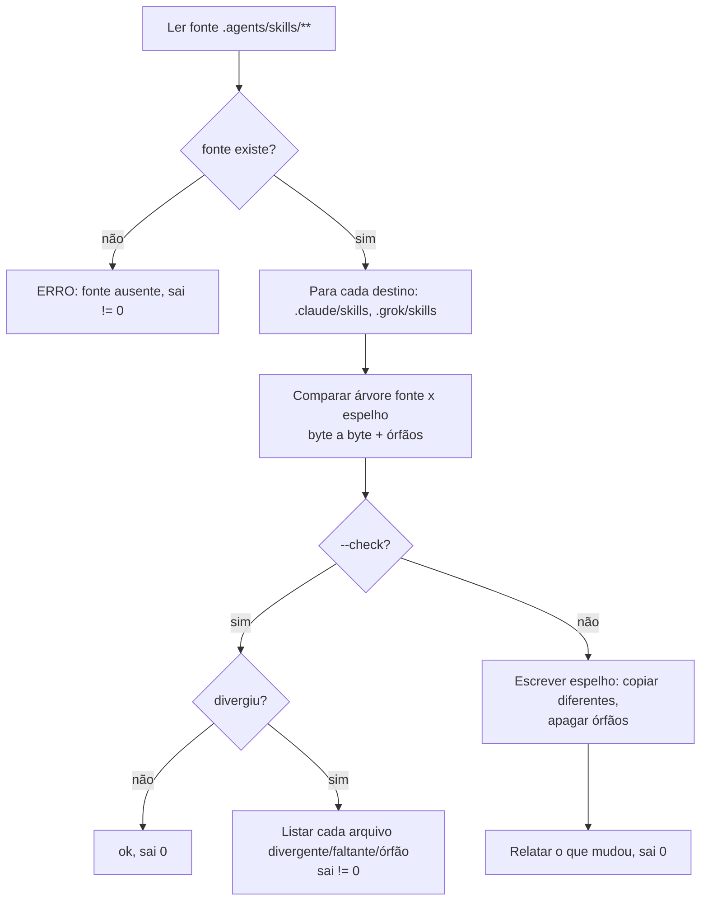

# Design — porta de entrada multi-vendor

## Princípio

Uma fonte, espelhos burros, e um guarda que impede editar o espelho. Sem isso, "fonte única" é só uma intenção escrita num arquivo que ninguém lê na hora de errar.

Separação de papéis entre os gates, para não ter dois donos do mesmo fato:

- **Conteúdo de skill** (frontmatter, `formato`, refs internas, eval obrigatório) é validado na **fonte**, `.agents/skills/`.
- **Identidade do espelho** (byte a byte, sem órfão) é validada pelo gate novo de drift.

## `tools/sync_skills.py`

Programa novo, então nasce com grafo, conforme `.claude/rules/graph-engineering.md`.

**Wait test:** listar → comparar → relatar é dependência real de dado em todas as arestas; os dois destinos (`.claude`, `.grok`) são independentes entre si e poderiam ser paralelos, mas o volume (duas pastas pequenas) não paga a complexidade — fica sequencial por decisão, não por falsa dependência.

**Contrato:**

| Aspecto | Decisão |
|---|---|
| Fonte | `.agents/skills/<nome>/` (recursivo: `SKILL.md`, `scripts/`, `references/`, `assets/`) |
| Destinos | `.claude/skills/<nome>/` e `.grok/skills/<nome>/` |
| Identidade | byte a byte; comparação por conteúdo, não por mtime (mtime muda em todo clone) |
| Órfão | pasta ou arquivo no destino que não existe na fonte: apagado no modo escrita, reportado no `--check` |
| Idempotência | rodar duas vezes seguidas não muda nada na segunda |
| Saída `--check` | lista de caminhos com o motivo (`divergente` / `faltante` / `órfão`), exit != 0 |
| Sem dependência externa | só stdlib, como o resto de `tools/` |

## Guarda de escrita no espelho

Hook novo `.claude/hooks/guarda_espelho.py`, evento `PreToolUse` em `Edit|Write|MultiEdit`.

- Lê o payload do Claude Code (`tool_input.file_path`), mesmo shape que `guarda_segredo.py` já consome.
- Se o caminho cair sob `.claude/skills/` ou `.grok/skills/`, nega e devolve a mensagem apontando o caminho equivalente em `.agents/skills/` e o comando `python tools/sync_skills.py`.
- **Atenção:** `.claude/hooks/run_hook.sh` tem allowlist explícita de 5 scripts (`run_hook.sh:11`). O script novo não roda se não entrar nela — é o tipo de fiação que nasce sem prova de estar ligada, então tem teste próprio.

## AGENTS.md depois

Ordem das seções, do mais acionável para o menos:

1. **Cabeçalho** — uma linha dizendo que este é o arquivo único e como cada agente chega nele.
2. **Cobertura por agente** — tabela de no máximo 6 linhas: o que Codex / Grok / Cursor / Claude Code carregam e o que não carregam. É caveat, não overview: diz ao agente o que ele **não** tem.
3. **Router de topo** — a tabela que já existe, com os caminhos hoje faltantes citados entre crases (`SECURITY.md`, `README.md`, cada rule, cada doc).
4. **Hard Rules** — mantidas na íntegra (são imperativos, categoria que o paper mede como bem seguida).
5. **Verificação** — mantida.
6. **Regras globais** — mantidas, com as rules citadas uma a uma.

**Sai:** a seção "Arquitetura WAT" inteira (4 parágrafos de overview), a frase "Os 4 modos de falha que mais derrubam acerto", o parágrafo "Resumo" do fim, e o preâmbulo do `CLAUDE.md`. Onde o conteúdo tiver valor histórico, vai para `docs/`, não para o texto sempre-carregado.

## Cortes nas rules (plano da trilha C)

| Arquivo | Fica | Sai |
|---|---|---|
| `.claude/rules/conduta-colaborador.md` | distinção intenção-de-negócio (pergunta) × mecânica-reversível (não pergunta); "todo trabalho nasce em branch, merge é decisão humana" | "Versionamento é padrão" (aplicado por `guarda_bash.py`), "Segredos" (aplicado por `guarda_segredo.py` + gitleaks), "Onde vive cada coisa" (duplica o router), "Entrega com evidência" (duplica a seção Verificação) |
| `.claude/rules/loop-engineering.md` | contrato de marker (só após sucesso completo, contém a janela, silêncio legítimo também escreve) | tabela dos três freios e template do bloco Freios (instanciados em `workflows/_exemplo-rotina/`) |

## Pontos de código que aprendem o caminho novo

| Arquivo | Mudança |
|---|---|
| `tests/test_criacao_nova.py:31` | `SKILLS = ".agents/skills/"` |
| `tests/test_evals_estrutura.py:20` | `SKILLS_DIR = RAIZ / ".agents" / "skills"` + asserção de que achou >= 1 skill |
| `tools/lint_routers.py:423` | alvo de `/nome` passa a ser `.agents/skills/<nome>/SKILL.md` |
| `.claude/rules/estrutura-e-logging.md:5` | `paths:` inclui `.agents/skills/**` |
| `.claude/rules/conduta-colaborador.md:31` | modelo de skill aponta para `.agents/skills/_exemplo-skill/` |
| `tools/CLAUDE.md:8`, `AGENTS.md`, `README.md` | comando de eval passa `--skills-dir .agents/skills` |
| `.gitignore` | `!/.agents/` e `!/.grok/` na seção "Pastas versionadas" |

`tools/doctor.py` e `tools/policy_check.py` não têm caminho `.claude` literal — não mudam.

## Riscos

- **Espelho versionado duplica conteúdo no git.** Aceito: é o preço de não usar symlink numa VM Windows sem Developer Mode, e o gate garante que a duplicata nunca diverge.
- **Quem edita pelo Cursor ou Codex não tem o guarda de escrita** (S3). O guarda é do Claude Code. Mitigação: o gate de drift reprova antes do push nos quatro casos, porque roda na suíte, não no editor.
- **`.grok/skills/` não é verificável nesta máquina** (Grok Build não está instalado). O que se garante é que o espelho existe e é idêntico; que o Grok o lê é fato de documentação, não medido aqui.
