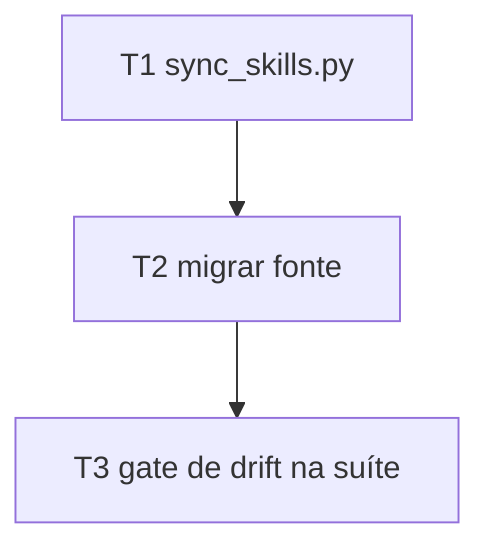
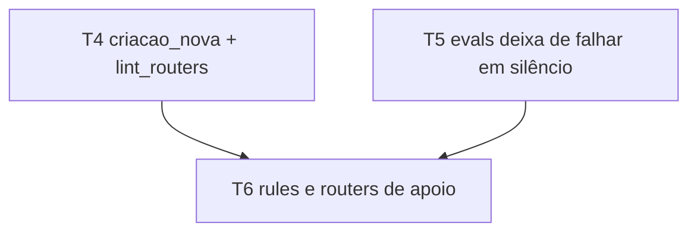
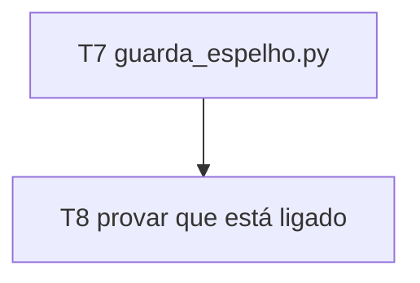
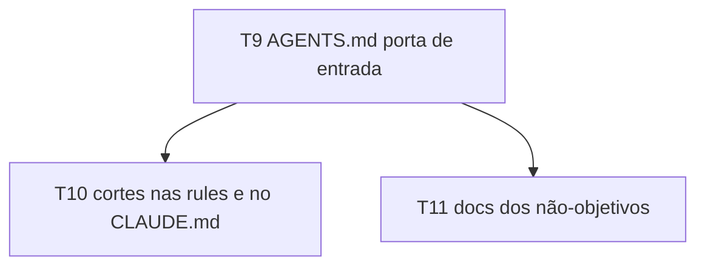
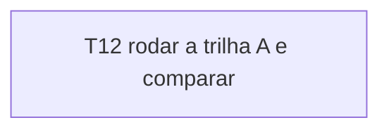

# Tasks — porta de entrada multi-vendor

O mecanismo nasce antes da migração, a migração antes de os gates aprenderem o caminho, o guarda depois de existir o que guardar, e o texto por último — porque o texto cita os caminhos que as fases anteriores criam.

## Task Breakdown

## Phase 1 — Mecanismo e fonte única

### T1: `tools/sync_skills.py` com `--check` — concluída

Script de stdlib que espelha `.agents/skills/` em `.claude/skills/` e `.grok/skills/`, byte a byte, apagando órfãos no modo escrita e listando divergência no modo `--check`.

Depends on: none
Requirements: SKL-02, SKL-03
Tests: `tests/test_sync_skills.py` com fixtures em `tmp_path` — espelho idêntico sai 0; arquivo divergente sai != 0 nomeando o caminho e o motivo `divergente`; arquivo faltante sai != 0 com motivo `faltante`; pasta órfã sai != 0 com motivo `órfão`; modo escrita corrige os três casos; rodar duas vezes não muda nada na segunda; fonte ausente sai != 0 sem criar nada.
Gate: `python -m pytest tests/test_sync_skills.py -q`

### T2: migrar a fonte e liberar os diretórios no git — concluída

`git mv .claude/skills/_exemplo-skill .agents/skills/_exemplo-skill`; acrescentar `!/.agents/` e `!/.grok/` na seção "Pastas versionadas" do `.gitignore`; rodar `python tools/sync_skills.py` para gerar e versionar os dois espelhos.

Depends on: T1
Requirements: SKL-01
Tests: `tests/test_sync_skills.py::test_repo_real_sem_drift` — `--check` sobre o repositório real sai 0 e as três árvores têm o mesmo conjunto de caminhos relativos no índice git.
Gate: `python tools/sync_skills.py --check`

### T3: gate de drift na suíte — concluída

O `--check` do repositório real vira teste da suíte e o arquivo entra em `GATES_OBRIGATORIOS` do `conftest.py` com a contagem de testes coletados.

Depends on: T2
Requirements: SKL-04
Tests: prova de discriminação — alterar um byte num espelho faz a suíte reprovar, desfazer volta ao verde.
Gate: `python tools/gate_veredito.py`

## Phase 2 — Gates aprendem o caminho novo

### T4: `test_criacao_nova.py` e `lint_routers.py` apontam para a fonte — concluída

`SKILLS = ".agents/skills/"` em `tests/test_criacao_nova.py:31`; em `tools/lint_routers.py:423` o alvo de uma referência `/nome` passa a ser `.agents/skills/<nome>/SKILL.md`.

Depends on: none
Requirements: GAT-02
Tests: `tests/test_criacao_nova.py` segue enxergando a skill de exemplo com contagem maior que zero; teste provando que `/skill-inexistente` reprova no lint e `/_exemplo-skill` passa, resolvendo contra `.agents/skills/`.
Gate: `python -m pytest tests/test_criacao_nova.py -q`

### T5: `test_evals_estrutura.py` deixa de falhar em silêncio — concluída

`SKILLS_DIR` passa a apontar para `.agents/skills` e o arquivo ganha asserção de que descobriu pelo menos uma skill. Hoje `descobrir_skills` devolve dicionário vazio quando o diretório não existe e os quatro testes seguem verdes vendo nada.

Depends on: none
Requirements: GAT-01
Tests: teste que reprova com a fonte vazia ou ausente (apontando para um `tmp_path` vazio) e passa com a fonte real; os quatro testes existentes continuam verdes.
Gate: `python -m pytest tests/test_evals_estrutura.py -q`

### T6: rules e routers de apoio aprendem o caminho — concluída

`paths:` de `.claude/rules/estrutura-e-logging.md` inclui `.agents/skills/**`; `.claude/rules/conduta-colaborador.md` aponta o modelo para `.agents/skills/_exemplo-skill/`; `tools/CLAUDE.md` e `README.md` passam `--skills-dir .agents/skills`.

Depends on: T4, T5
Requirements: GAT-04
Tests: busca provando que nenhum arquivo versionado de instrução ainda manda rodar o eval contra `.claude/skills`; o lint de routers reprova referência morta.
Gate: `python tools/lint_routers.py`

## Phase 3 — Guarda de escrita no espelho

### T7: hook `guarda_espelho.py` — concluída

Nega `Edit`, `Write` e `MultiEdit` sob `.claude/skills/` e `.grok/skills/`, devolvendo o caminho equivalente em `.agents/skills/` e o comando de sincronização. Mesmo shape de payload que `guarda_segredo.py` já consome.

Depends on: T2
Requirements: SKL-05
Tests: `tests/test_guarda_espelho.py` — Write em `.claude/skills/x/SKILL.md` negado com a mensagem citando `.agents/skills/x/SKILL.md`; idem `.grok/skills/`; escrita em `.agents/skills/` permitida; escrita fora das três árvores permitida; payload malformado não derruba o hook.
Gate: `python -m pytest tests/test_guarda_espelho.py -q`

### T8: provar que o guarda está ligado — concluída

O script entra na allowlist de `.claude/hooks/run_hook.sh` e no `PreToolUse` de `.claude/settings.json`. Guarda novo nasce sem prova de ser chamado; esta task é essa prova.

Depends on: T7
Requirements: SKL-05
Tests: teste que lê os dois arquivos e afirma que `guarda_espelho.py` está nas duas listas; discriminação removendo o nome da allowlist e confirmando que o teste reprova.
Gate: `python tools/gate_veredito.py`

## Phase 4 — AGENTS.md e enxugamento

### T9: `AGENTS.md` vira porta de entrada explícita

Acrescenta a tabela de cobertura por agente com no máximo 6 linhas; cita entre crases `SECURITY.md`, `README.md`, cada arquivo de `.claude/rules/` e cada documento de `docs/`; remove a seção "Arquitetura WAT", a frase "Os 4 modos de falha que mais derrubam acerto" e o parágrafo "Resumo".

Depends on: T6
Requirements: ENT-01, ENT-03, ROT-01, ENX-01
Tests: teste afirmando que todo caminho citado entre crases no `AGENTS.md` existe no índice git e que os caminhos obrigatórios estão presentes (`SECURITY.md`, as 6 rules, os 4 docs).
Gate: `python tools/lint_routers.py`

### T10: cortes nas rules e no `CLAUDE.md`

Aplica o plano KEEP/CUT da trilha C nas duas rules MIXED e remove o preâmbulo duplicado do `CLAUDE.md`, preservando a primeira linha `@AGENTS.md`.

Depends on: T9
Requirements: ENT-02, ENX-02, ENX-03
Tests: teste afirmando que a primeira linha do `CLAUDE.md` é `@AGENTS.md` e que cada frase KEEP das duas rules segue presente literalmente; medição de linhas do conjunto sempre-carregado menor que a da `main`.
Gate: `python tools/gate_veredito.py`

### T11: documentar o que cada vendor não recebe

Documento em `docs/` listando, por agente, qual peça do harness não é fornecida, o motivo e o que seria preciso. Citado por caminho no `AGENTS.md`.

Depends on: T9
Requirements: ESC-01
Tests: teste de roteamento afirmando que o caminho do documento existe no índice git e é citado no `AGENTS.md`.
Gate: `python tools/lint_routers.py`

## Phase 5 — Evidência

### T12: rodar a trilha A do `harness-eval` e registrar o antes/depois

Roda `inventory_extract.py` e `track_a_correctness.py` contra o repositório, com saída fora dele, e registra a comparação com o run `2026-09-13-trilhaA`.

Depends on: T11
Requirements: ROT-02, GAT-03
Tests: comparação do `inventory.json` novo com o antigo afirmando que `SECURITY.md`, os 6 arquivos de `.claude/rules/` e a skill de `.agents/skills/` entraram na superfície, e que o `04-correctness.json` segue com zero findings.
Gate: `python tools/gate_veredito.py`

## Execution Plan

| Batch | Tasks | Fases | Natureza |
|---|---|---|---|
| 1 | T1, T2, T3 | Phase 1 | mecânica: script novo, migração de pasta, gate |
| 2 | T4, T5, T6 | Phase 2 | mecânica: constantes de caminho e asserção de sensor |
| 3 | T7, T8 | Phase 3 | mecânica: hook e prova de fiação |
| 4 | T9, T10, T11 | Phase 4 | texto: a qualidade da escrita é o produto |
| 5 | T12 | Phase 5 | medição |

Batches rodam em sequência; um batch não começa antes de o anterior reportar todas as tasks commitadas. O batch 4 é o único que não é mecânico — reescrever o texto sempre-carregado é onde a feature acerta ou erra.

## Gate Check Commands

| Comando | Esperado |
|---|---|
| `python tools/sync_skills.py --check` | exit 0, sem divergência |
| `python -m pytest tests/test_sync_skills.py -q` | verde |
| `python -m pytest tests/test_evals_estrutura.py -q` | verde |
| `python -m pytest tests/test_guarda_espelho.py -q` | verde |
| `python tools/gate_veredito.py` | `veredito: VERDE` |
| `python tools/lint_routers.py` | `0 erro(s)` |

## Test Coverage Matrix

| Requisito | Task | Teste | Critério |
|---|---|---|---|
| SKL-01 | T2 | `test_repo_real_sem_drift` | AC-3 |
| SKL-02 | T1 | `tests/test_sync_skills.py` (modo escrita) | AC-3 |
| SKL-03 | T1 | `tests/test_sync_skills.py` (modo `--check`) | AC-4 |
| SKL-04 | T3 | discriminação por byte alterado | AC-4 |
| SKL-05 | T7, T8 | `tests/test_guarda_espelho.py` | AC-5 |
| GAT-01 | T5 | sensor de fonte vazia | AC-9 |
| GAT-02 | T4 | `tests/test_criacao_nova.py` e lint | AC-10 |
| GAT-03 | T12 | `gate_veredito.py` e `lint_routers.py` | AC-10 |
| GAT-04 | T6 | lint de referência morta | AC-10 |
| ENT-01 | T9 | teste de roteamento | AC-1 |
| ENT-02 | T10 | primeira linha do `CLAUDE.md` | AC-1 |
| ENT-03 | T9 | tabela de cobertura presente | AC-2 |
| ROT-01 | T9 | caminhos obrigatórios citados | AC-6 |
| ROT-02 | T12 | comparação de `inventory.json` | AC-7 |
| ENX-01 | T9 | ausência da seção de overview | AC-8 |
| ENX-02 | T10 | frases KEEP presentes | AC-8 |
| ENX-03 | T10 | medição de linhas | AC-8 |
| ESC-01 | T11 | documento citado e existente | AC-11 |
