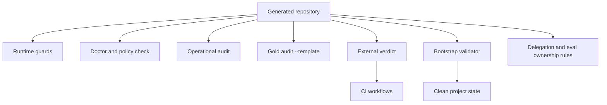

# Template v2 Design

**Spec**: `.specs/features/template-v2/spec.md`
**Status**: Draft

## Architecture Overview

V2 is a clean evolution of the existing template. It ports only generic controls from the maintained cockpit, retaining the template's existing routers and its canonical upstream relationship for the eval runner. A bootstrap validator separates v2 build evidence from what a newly generated project is allowed to retain.

## Code Reuse Analysis

| Component | Source | V2 use |
| --- | --- | --- |
| Runtime guards | `Cakopit-codex/tools/cockpit_runtime.py` | Port reusable locking, retry, atomic-write, backup, and redaction primitives with their outcome tests. |
| Doctor, operational audit, and gold audit | `Cakopit-codex/tools/doctor.py`, `tools/operational_audit.py`, `tools/padrao_ouro_audit.py` | Port generic contracts; `--template` belongs only to the gold audit. |
| Security and repository policy | `Cakopit-codex/tools/policy_check.py`, `.env.example`, `.gitignore` | Port only generic secret and environment policy. |
| External verdict and router lint | `Cakopit-codex/tools/gate_veredito.py`, `tools/lint_routers.py`, `tools/canario_gate/` | Reuse the independent-verdict pattern and recalibrate repository-specific counts. |
| CI and lock | `Cakopit-codex/.github/workflows/`, `requirements.in`, `requirements.txt`, `.python-version` | Port pinned, portable workflows and declared dependencies; omit self-hosted configuration and gitleaks exceptions. |
| Cheap delegation | `Cakopit-codex/.claude/rules/delegacao-barata.md`, `.codex/config.toml` | Rewrite names and examples as optional Codex guidance with Luna as a selectable default. |

## Components

### Portable runtime

- **Purpose**: Make recurring workflow execution bounded, exclusive, recoverable, and safe to diagnose.
- **Location**: `tools/cockpit_runtime.py`
- **Interfaces**: lock context manager, bounded retry helper, atomic evidence writer, redaction helper, backup manifest validation.
- **Dependencies**: Python standard library.
- **Reuses**: Maintained cockpit implementation and its behavior-level test matrix.

### Repository health and gold controls

- **Purpose**: Diagnose safe configuration, scan tracked policy inputs, and audit the ten portable operational contracts.
- **Location**: `tools/doctor.py`, `tools/policy_check.py`, `tools/operational_audit.py`, `tools/padrao_ouro_audit.py`
- **Interfaces**: command-line exit status and value-free findings; only gold audit supports `--template`.
- **Dependencies**: runtime helpers where appropriate and Git metadata only.

### Independent verification and CI

- **Purpose**: Prevent a compromised or partial pytest run from declaring the template healthy.
- **Location**: `conftest.py`, `tools/gate_veredito.py`, `tools/canario_gate/`, `.github/workflows/`
- **Interfaces**: `python tools/gate_veredito.py`; CI invokes it rather than raw pytest.
- **Dependencies**: hash-locked test/lint dependencies.

### Clean-instance bootstrap validator

- **Purpose**: Initialize a generated repository with a narrow, reviewable cleanup recipe and validate its baseline.
- **Location**: `tools/initialize_template.py`, `tools/validate_new_instance.py`
- **Interfaces**: `python tools/initialize_template.py --dry-run .`, then `python tools/initialize_template.py .`; validator is read-only and returns path findings.
- **Dependencies**: standard library and repository tree.

### Agent and eval conventions

- **Purpose**: Make inexpensive delegation available where the harness supports it while preserving upstream eval ownership.
- **Location**: `.claude/rules/delegacao-barata.md`, `.codex/config.toml`, `tools/eval_runner.py` header or synchronization test.
- **Interfaces**: written contract; no mandatory runtime dependency on Codex.
- **Dependencies**: existing template eval structure and the immutable canonical plugin-runner commit supplied by the upstream change; never an unmerged local cockpit copy.

## Error Handling Strategy

| Error scenario | Handling | User impact |
| --- | --- | --- |
| Unsafe environment file or tracked secret | Fail closed, name the affected path only | Clear remediation without secret disclosure. |
| Stale lock or retry exhaustion | Recover only verified-dead owners; stop at bounded deadline | No concurrent mutation or infinite wait. |
| Missing template control | Audit exits nonzero with contract and path | Generated repository cannot claim a passing baseline. |
| Build evidence in a generated instance | Initialization removes only known v2 records after dry-run; validator identifies any remainder | The user retains control of all unrelated files. |

## Risks & Concerns

| Concern | Location | Impact | Mitigation |
| --- | --- | --- | --- |
| Porting tests with hard-coded collection counts | `Cakopit-codex/conftest.py` | A legitimate template test count may be mistaken for tampering. | Recalibrate only after measured collection and test the failure branch. |
| Existing eval runner copy could drift from its upstream owner | `tools/eval_runner.py` | Template might become an accidental canonical implementation. | Preserve synchronization proof and name upstream ownership in the local contract. |
| GitHub template creation copies the default branch's files | GitHub template behavior | `export-ignore` cannot create a clean generated repository. | Keep build evidence in the review branch; before default-branch publication use the explicit initialization recipe and prove it in a temporary generated copy. |

## Tech Decisions

| Decision | Choice | Rationale |
| --- | --- | --- |
| Runtime surface | Port portable guards exactly where behavior remains generic | Mature deterministic code is safer than recreating it. |
| Audit behavior | Operational audit always requires 10.0; gold audit alone has `--template` | The actual CLI keeps template-placeholder handling separate from operational controls. |
| Delegation | Opt-in Codex capability with Luna only when the harness offers it; otherwise use the harness default or inline execution | Users can save cost without requiring a single agent platform or model. |
| Eval ownership | Plugin repository remains canonical and v2 pins the immutable supplied upstream commit | Ownership stays singular, auditable, and independent of an unmerged local copy. |
| Freshness proof | Explicit, dry-run initialization plus read-only new-instance validator and temp-copy test | It proves a clean instance while limiting mutation to known build evidence. |
