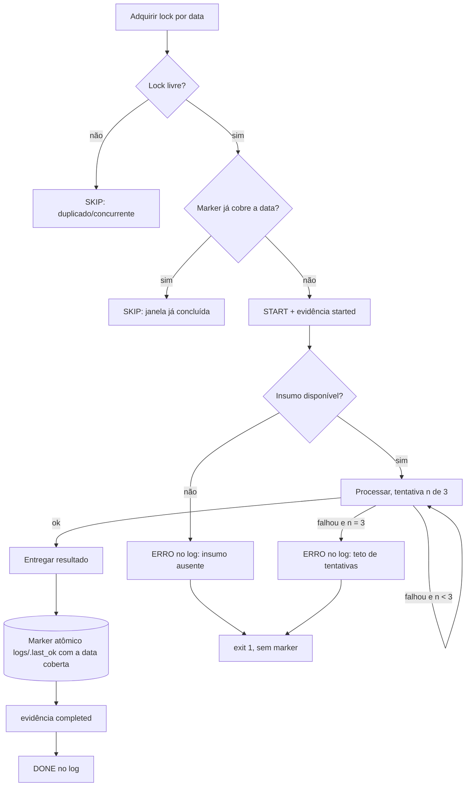

# Rotina-exemplo — SOP modelo

Modelo de rotina agendada. Copie a pasta, renomeie, troque o conteúdo — mantenha a estrutura: este arquivo (SOP + grafo), `scripts/` com o `.py` e os dois wrappers, `logs/` fora do git.

## Objetivo

Demonstrar o contrato mínimo de uma rotina do cockpit: log TSV, lock de idempotência,
teto de tentativas, evidência estruturada e marker escrito só após sucesso.

## Inputs

- Nenhum externo (o stub gera o próprio "insumo"). Numa rotina real: arquivo, API, tabela — declarar aqui a origem e o que acontece quando falta.

## Outputs

- `logs/log.txt` — TSV `data\thora\tNIVEL\tmensagem` (formato na rule `estrutura-e-logging`).
- `logs/.last_ok` — marker com a data coberta, escrito **só** quando o run inteiro deu certo.
- `logs/.rotina_exemplo.lock` — lock efêmero por janela; locks mais antigos que o prazo
  são recuperados e preservados como evidência `.stale.*`.
- `logs/evidence/*.json` — eventos estruturados duráveis (`started` e `completed`), sem
  valores sensíveis.

## Grafo



O laço em `C` é retry local com teto (não muda o formato dominante: a rotina continua uma cadeia).

## Erros

| Situação | O que o script faz | O que o humano faz |
|---|---|---|
| Insumo ausente | `ERRO` no log com o nome do insumo; exit 1; sem marker | Conferir a origem do insumo |
| Falha transitória | Retenta até 3 vezes; na 3ª, `ERRO` dizendo em qual tentativa parou | Ler o `detalhe` do último `ERRO` |
| Falha na entrega | `ERRO`, exit 1, marker **não** é escrito | Marker antigo denuncia a janela sem cobertura |
| Falha ao durabilizar o marker no Windows | O arquivo temporário é reaberto com descriptor gravável (`r+b`) antes de `fsync`; o rename atômico e a idempotência são preservados | Verificar permissões e o erro de disco se a falha persistir |
| Run duplicado ou concorrente | `SKIP`, exit 0; o segundo processo não executa processamento/entrega | Nenhuma ação; lock garante uma execução por janela |
| Lock stale | Após 5 min, recupera o lock somente quando o dono registrado não está vivo no host; preserva o arquivo anterior como `.stale.*` | Investigar os arquivos stale se forem frequentes |

## Freios

- Teto de tentativas por etapa: 3
- Duração máxima do run: 5 min — estourou, encerra com `ERRO` no log e para
- Estagnação: se as últimas 3 execuções falharam no mesmo ponto, NÃO rodar de novo; avisar e parar
- Concorrência: um lock exclusivo por data; nunca executar duas entregas para a mesma janela.

## Evidência

- Marker `logs/.last_ok` escrito **somente após o sucesso completo**, contendo a data coberta (`AAAA-MM-DD`). Falha parcial não escreve; "não havia nada a fazer" escreve (silêncio legítimo é diferente de morte).
- A escrita do marker é feita em arquivo temporário no mesmo diretório, com `fsync` e
  `rename` atômico; uma falha de disco não deixa um marker parcialmente escrito.
- `logs/evidence/` contém eventos JSON atômicos; o evento `completed` só aparece depois
  da entrega e do marker.
- Um vigia externo compara a **data** do marker com a janela esperada, nunca a mera existência do arquivo.

## Agendamento

Registrar no agendador da máquina apontando para `scripts/rotina_exemplo.vbs` (sem janela) — o `.vbs` chama o `.bat`, que ativa o venv relativo e chama o `.py`, propagando o exit code em toda a cadeia.

Quem registra o agendamento é o próprio agente, na sessão em que a rotina nasce ou muda. Nos comandos abaixo, `<RAIZ>` é a raiz do repositório **na máquina onde a rotina vai rodar**: o agente descobre na hora (`pwd` no shell, `Get-Location` no PowerShell) e substitui antes de executar — o valor não fica versionado, porque muda de máquina para máquina (o auditor reprova caminho absoluto em arquivo do repo).

**Windows** (Agendador de Tarefas, via `schtasks`; ajuste o horário ao caso real):

```
schtasks /create /tn "rotina-exemplo" /tr "wscript.exe <RAIZ>\workflows\_exemplo-rotina\scripts\rotina_exemplo.vbs" /sc daily /st 07:00
```

**Linux/Mac** (`cron`; o `cd` é obrigatório porque o cron não executa a partir do repo, e o venv relativo depende disso):

```
0 7 * * * cd <RAIZ> && .venv/bin/python workflows/_exemplo-rotina/scripts/rotina_exemplo.py
```

Depois de registrar, o agente confere com `schtasks /query /tn "rotina-exemplo"` (Windows) ou `crontab -l` (Linux/Mac) e cola a saída real na entrega — agendamento se prova pelo registro, não pela afirmação de que foi feito.
